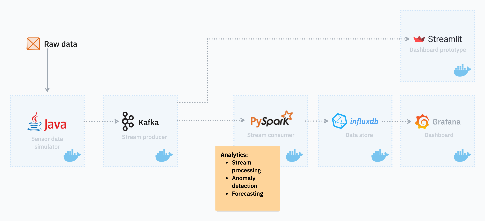
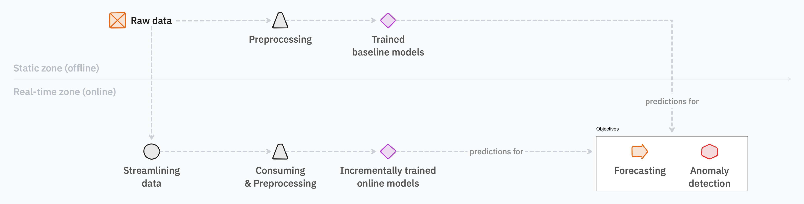

# Open-source Technologies & Stream Mining Joint Project

This repository is for the joint project of subjects **Open-source Technologies** and **Stream Mining** of the *Data Science MSc program* at *ELTE*.

Project guidelines: [Open guidelines](https://docs.google.com/document/d/1fuBle3d4tmhY9IHqBDA9KwckhSqOCugGWldIe8CeRHc/edit?tab=t.0#heading=h.mzrt1sfgv63y)

## About the project

In this project, sensor data related to air quality is simulated, streamlined, processed, modeled, stored, and visualized to develop a full-stack *stream mining* data science project powered by *open-source technologies*.

The sensor data includes readings of pollutants such as *Carbon Monoxide (CO)*, *Nitrogen Dioxide (NO2)*, along with measurements of *Temperature*, and *Absolute* / *Relative Humidity*.

Objectives are to detect abnormal changes in the sensor readings and to create short-term forecasts to support planning and public health responses in the simulation.

## Team members

* Albazzal, Houmam [(🐙 dolorsy)](https://github.com/dolorsy)
* Balogh, Máté [(🐙 matthew-balogh)](https://github.com/matthew-balogh)
* Földvári, Ádám [(🐙 25FAdam)](https://github.com/25FAdam)
* Lahmar, Abderraouf [(🐙 abderraouf-000)](https://github.com/abderraouf-000)
* Nagy, Zsuzsanna [(🐙 NZsuzsi)](https://github.com/NZsuzsi)

## Structure of the repository

The repository itself is organized as follows:

* `_images/`: Images included in other files
* `_reports/`: In-semester reports related to the project
* `_dashboards/`: Screenshots of implemented dashboards
* `_documentation/`: The formal documentation of the project

## Overview of the utilized technologies

### Architecture diagram

High-level architecture design of the full-stack project denoting the selected open-source technology for each stage of the pipeline.

### Modeling diagram

High-level view of the online machine learning pipeline.

### Team member responsibilities

| Team member        | Main responsibilities                               |
| ------------------ | --------------------------------------------------- |
| Albazzal, Houmam   | Containerization, Data Streamlining                 |
| Balogh, Máté       | Anomaly Detection, Pipeline Integration             |
| Földvári, Ádám     | ML modeling, Forecasting                            |
| Lahmar, Abderraouf | Calculation and Combination of Statistics, Database |
| Nagy, Zsuzsanna    | Dashboarding                                        |
