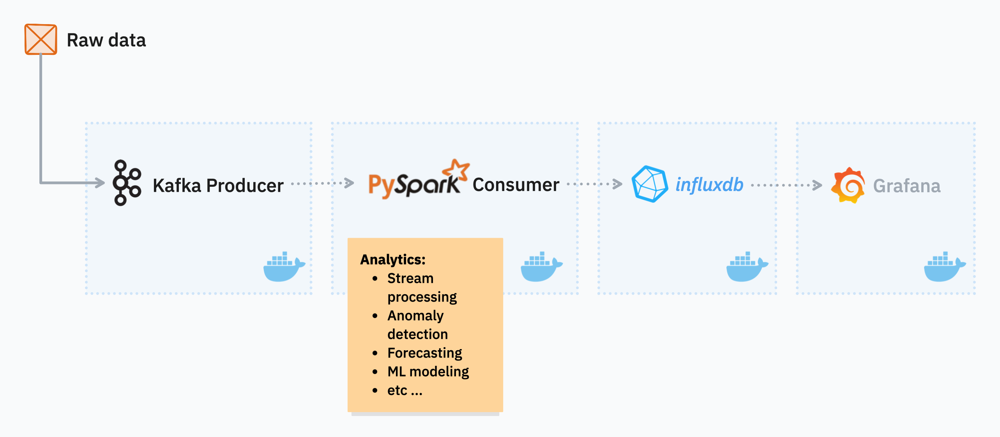

# Open-source Technologies & Stream Mining Joint Project

This repository is for the joint project of subjects **Open-source Technologies** and **Stream Mining** of the *Data Science MSc program* at *ELTE*.

Project guidelines: [Open guidelines](https://docs.google.com/document/d/1fuBle3d4tmhY9IHqBDA9KwckhSqOCugGWldIe8CeRHc/edit?tab=t.0#heading=h.mzrt1sfgv63y)

## Team members

* Albazzal, Houmam [(🐙 dolorsy)](https://github.com/dolorsy)
* Balogh, Máté [(🐙 matthew-balogh)](https://github.com/matthew-balogh)
* Földvári, Ádám [(🐙 25FAdam)](https://github.com/25FAdam)
* Lahmar, Abderraouf [(🐙 abderraouf-000)](https://github.com/abderraouf-000)
* Nagy, Zsuzsanna [(🐙 NZsuzsi)](https://github.com/NZsuzsi)

## Structure of the repository

Tasks are managed at the [GitHub Board](https://github.com/users/matthew-balogh/projects/5).

The documentation can be found in [Documentation.md](Documentation.md). It includes project planning, literature review, data science and development documentations.

## Instructions to run

1. Copy `configuration.env.example` as `configuration.env`
2. Adjust configuration as needed or leave as is
3. Run `docker-compose up` in the root directory
4. Open `http://localhost:8086` to visit *Influxdb* UI

## Important elements from the documentation

Here you can find the important parts of the documentation that were extracted to be easily accessed here.

### Architecture diagram

### Team member responsibilities

| Team member        | Main responsibilities                               |
| ------------------ | --------------------------------------------------- |
| Albazzal, Houmam   | Containerization, Data Streamlining                 |
| Balogh, Máté       | Anomaly Detection, Pipeline Integration             |
| Földvári, Ádám     | ML modeling, Forecasting                            |
| Lahmar, Abderraouf | Calculation and Combination of Statistics, Database |
| Nagy, Zsuzsanna    | Dashboarding                                        |
