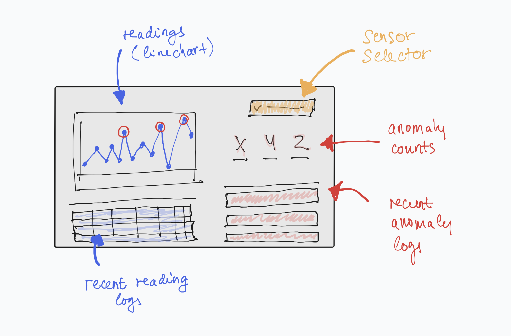
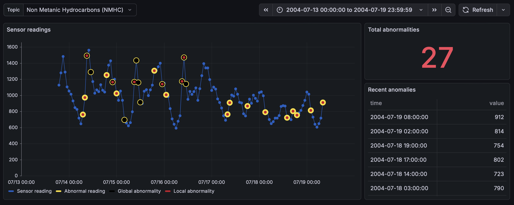
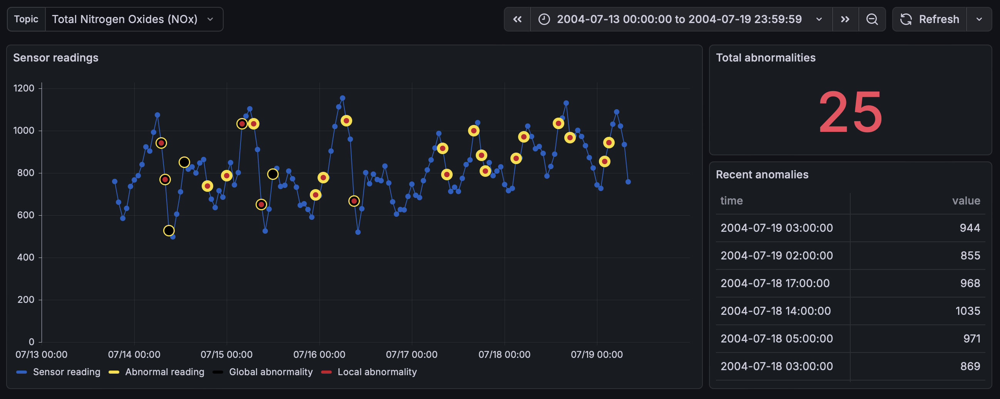
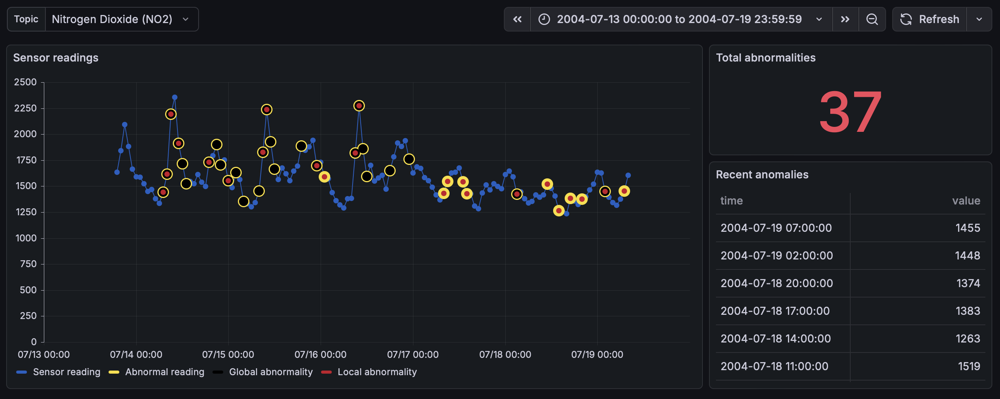
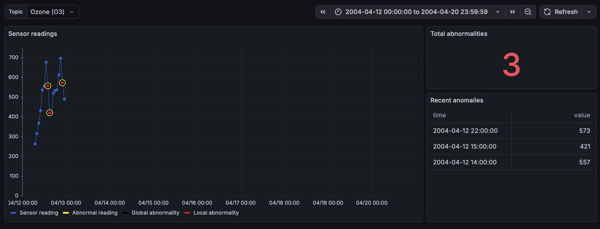
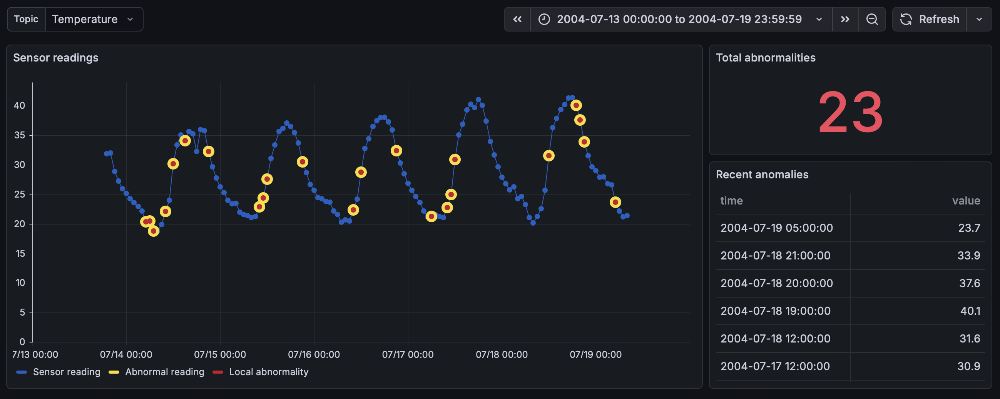
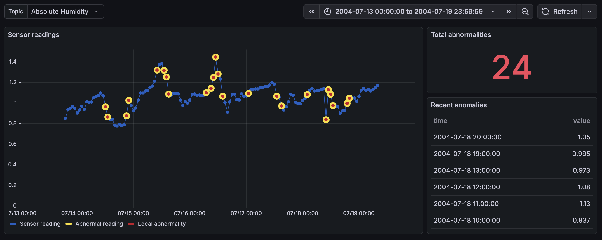
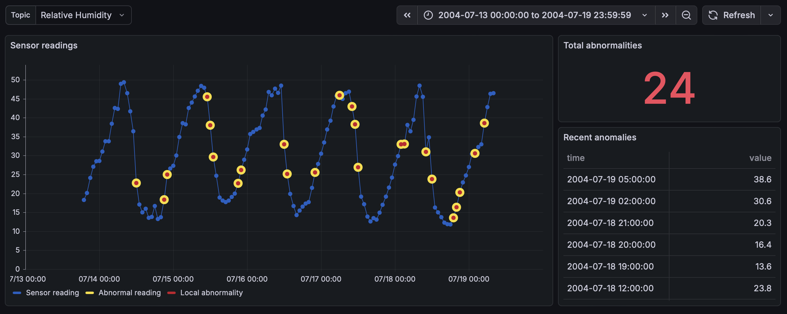

# Dashboards

## Prototypes

Before crafting interactive and sophisticated dashboard designs, prototypes were created in paper, *Streamlit*, and in *Grafana* itself.

# Actual dashboards

## All-sensors status

> [!NOTE]
> TODO

## Single-sensor status

> [!NOTE]
> TODO

## Abnormality (anomaly) inspector

### Predictions

### Performance evaluation

> [!NOTE]
> TODO

## Forecasting

### Predictions

> [!NOTE]
> TODO

### Performance evaluation

## Trend detection

> [!NOTE]
> TODO
