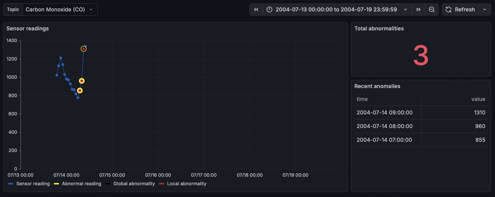
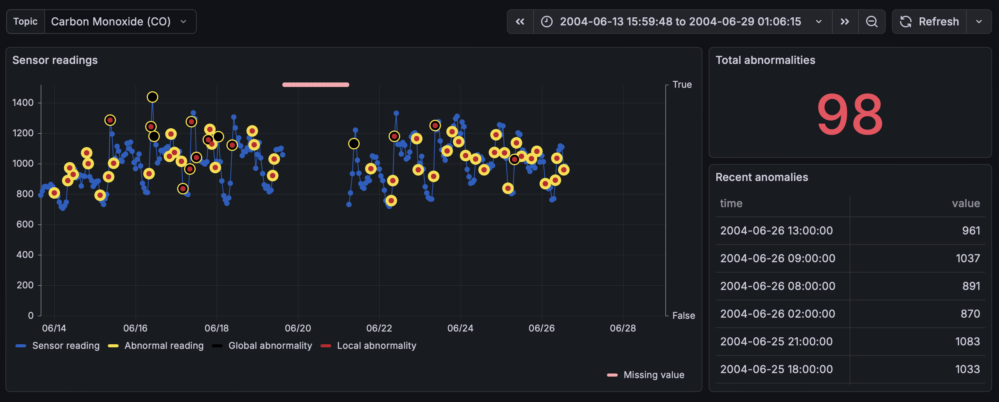
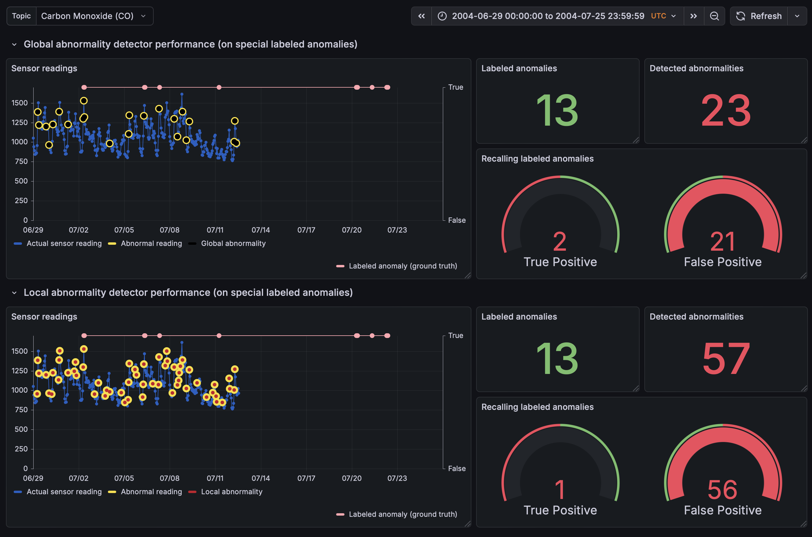
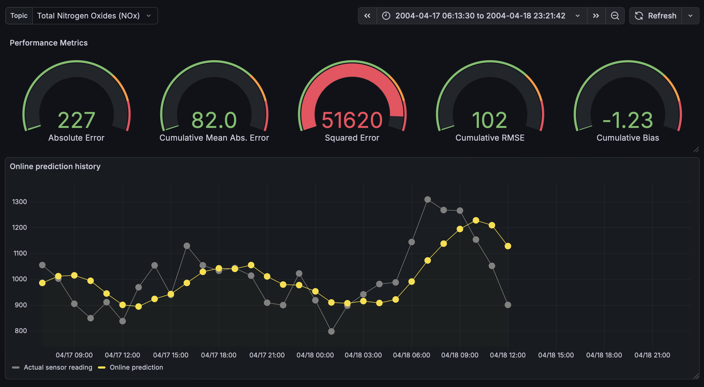
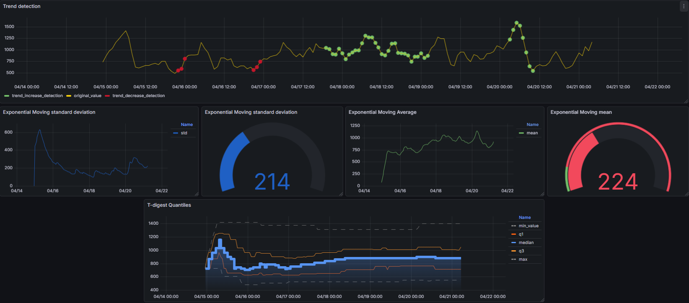

# Open-source Technologies and Stream Mining joint Project Documentation

*Smart City Air Quality Monitoring with Real-Time Stream Analytics
(SCAir-IoT)*

**Abstract**

As smart cities deploy large networks of IoT sensors, the ability to
collect, process, store, and interpret unbounded environmental data
becomes essential for supporting timely decision-making. In this work, a
system that processes IoT sensor data deployed in an Italian city was
developed with the objectives to detect abnormal changes in the sensor
readings in real-time and to create short-term forecasts to support city
planning and public health responses. The sensor data related to air
quality was simulated, streamlined, processed, modeled, stored, and
visualized to develop a full-stack stream mining data science project
powered by open-source technologies.

**TODO: write results & impact for each objective**

**Keywords:** *Anomaly detection, Forecasting, Stream mining,
Open-source technologies*

**Authors**

Albazzal, Houmam  
Balogh, Máté  
Földvári, Ádám  
Lahmar, Abderraouf  
Nagy, Zsuzsanna

**Mentored by**

Loubna Seddiki

## Introduction and Background

In stream mining, we are limited to a portion of data and make decisions
real-time in memory. As *Wares, Isaacs, and Elyan (2019)* highlight, in
traditional machine learning contexts, data is referred to as batch data
which can be loaded into memory in its entirety. According to the
authors,

> “this is of stark contrast to stream mining, where data streams
> produce elements in a sequential, continuous fashion, and may also be
> impermanent, or transient, in nature … This means stream data may only
> be available for a short time.”

The authors refer to *Babcock et al. (2002)*, highlighting that

> “once an element from a data stream has been processed, it is
> discarded or archived. It cannot be retrieved easily unless it is
> explicitly stored in memory, which is small relative to the size of
> data streams.”

This nature of streaming systems calls for solutions that support the
learning from the unbounded data without relying on stored records for
every single measurement. Architectural solutions such as *Kafka*,
*Spark*, data storages such as *Influxdb*, and algorithms that
iteratively learn from the data are important elements in this context.

**TODO: reference papers and introduce concrete techniques that were
utilized in the project**

*Müller and Chiu (2024)* introduce a general methodology for detecting
novelties in time-series data which was followed in the abnormality
(anomaly) detection part of the project.

## Dataset

The dataset is the *UCI Air Quality* dataset (*Vito, S. (2008)*) which
includes responses of gas sensor devices deployed in an Italian city.
Besides these device readings, each gas measurement has a counterpart
feature which denotes the gas concentration recorded by a co-located
certified analyzer. Additionally, readings related to temperature along
with absolute and relative humidity are included in the dataset. The
records span 1 year from March 2004 to February 2025, and present hourly
aggregated measurements. Missing values are denoted with the value of
`-200`.

## System architecture

<figure>

<figcaption aria-hidden="true">High-level view of the architecture with
the utilized open-source technologies denoted for each
component.</figcaption>
</figure>

The stream mining pipeline includes components of *simulator*,
*producer*, *consumer*, *data store*, and *dashboards* by which the raw
`csv` dataset file was ingested. We utilized open-source technologies of
*Java*, *Kafka*, *PySpark*, *Influxdb*, *Streamlit*, and *Grafana*
provisioned in a containerized environment via *Docker*. The
responsibility of each component is summarized as follows:

**Raw data**: Static file containing sensor measurements related to air
quality.

**Sensor data simulator**: Reads the raw data file and simulates flow of
sensor data.

**Kafka producer**: Streamlines the simulated sensor data into Kafka
topics in their datetime order. *Apache Kafka* serves as a distributed
event streaming platform that provides high-throughput, low-latency data
feeds with built-in fault tolerance through data replication across
brokers (*Apache Kafka Documentation*). The producer component, implemented
in Java, publishes sensor measurements to topic-partitioned streams,
ensuring that each sensor type (e.g., CO, NOx, temperature) is routed to
its dedicated topic. This design enables parallel processing and maintains
temporal ordering of measurements through the use of datetime-based keys,
which guarantees that messages with the same timestamp are processed
consistently across the distributed system.

**PySpark consumer**: Listens to the streamlined data and creates mini
batches to call analytical functions—such as Anomaly Detection and
Forecasting—on this windowed data. The consumer leverages *PySpark
Structured Streaming*, which provides a high-level API for processing
continuous data streams with exactly-once semantics and fault tolerance
(*Apache Spark Documentation*). The integration between Kafka and PySpark
is achieved through Spark's native Kafka connector, which allows seamless
reading from multiple Kafka topics in parallel. The consumer implements a
sliding window mechanism that buffers incoming messages per sensor topic
(default window size of 8 samples) and triggers analytical computations
whenever a new batch arrives. This micro-batch processing model, as
described by *Zaharia et al. (2016)*, enables real-time analytics while
maintaining the benefits of batch processing for complex machine learning
operations.

**Influxdb:** Data is then persisted in the database including the
online predictions and the original incoming data.

**Streamlit:** Streamlit is used to create dashboard prototypes without
the necessity of a database storage and connection. Kafka messages are
directly consumed by this component to display simple line charts and
anomaly detection related information and alerts.

**Grafana**: Dashboard visualization component that periodically fetches
the database for new data to show the latest insights in real-time.

## Modeling and Predictions

### Overview

<figure>

<figcaption aria-hidden="true">High-level view of the offline and online
machine learning pipeline.</figcaption>
</figure>

### Anomaly detection

For *Anomaly Detection*, different techniques were utilized ranging from
recognizing sensor readings with missing measurement to detecting local
and global outliers, in each sensor seperately.

Both, local and global approaches were developed with the general
novelty, outlier detection methodology in mind, where the steps are:

1.  Transform the data, to better reflect properties of interest
2.  Obtain a novelty function
3.  Apply peak picking algorithm on the novelty function

To detect local patterns in form of sudden changes (peaks and valleys),
an 8-sample window was utilized on the streamlined data. As part of the
data transformation, values of `-200` were replaced with `NA`. The most
recent element in the window was selected as a test sample to make
predictions for, while the rest of the in-window samples (at most 7)
were designated as historical training points. Derivative operation was
applied on the window data to turn a measurement value *x**T*
into the deviation from *x**T* − 1. This resulted in the
novelty function, where `NA` values were first imputed with the window
median but were transformed back to `NA` once the difference values were
obtained. During the “training”, the in-window estimator calulates
statistics (*I**Q**R*, *Q*1, *Q*3) from the in-window historical samples
to perform a traditional outlier detection test using the
*Q*1 − 1.5 × *I**Q**R* and *Q*3 + 1.5 × *I**Q**R* as thresholds to flag
the test sample as outlier.

To account for out-of-window global patterns and to implement a detector
that is applicable in stream mining systems where we cannot always rely
on storing every incoming data point, an online detector was implemented
using the *T-digest* algorithm. This method uses the same peak picking
strategy using the traditional outlier thresholds, yet the quartiles
along with the *Interquartile Range* get iteratively updated by each new
sample. The algorithm maintains a centroid-based representation about
these statistics using the incoming data and updates its state through
merges.

### Offline forecasting

The offline forecasting module represents a traditional Supervised
Machine Learning pipeline where models are trained on historical
datasets and deployed for inference on streaming data. This approach
prioritizes model complexity and accuracy over immediate adaptability,
assuming that the underlying statistical properties of the air quality
data remain relatively stable over short periods.

#### Model Training and Architecture

The foundation of this module is established in
**test_Modelling.ipynb**. The training process begins by loading the UCI
Air Quality dataset and performing rigorous preprocessing, including
datetime indexing and handling missing values (mapping sensor error
codes like **-200** to **NaN**). The core of the strategy relies on
**supervised feature engineering**, where the time-series problem is
transformed into a regression problem. The system constructs a rich
feature set comprising **lagged values** (1, 2, 3, 6, 12, 24 hours) to
capture immediate and daily dependencies, **rolling statistics** (mean
and standard deviation over 3, 6, 12-hour windows) to smooth volatility,
and **temporal embeddings** (hour of day, day of week, month).

The primary algorithm utilized is the **Histogram-based Gradient
Boosting Regressor** (HGBR). This algorithm is chosen for its efficiency
with large datasets and native handling of missing values (NaNs), which
are common in sensor networks. Separate models are trained for specific
forecast horizons (H+1, H+2, and H+3 hours ahead). These trained models,
along with their metadata, are serialized using **joblib** and stored in
the **artifacts/** directory, ensuring that the inference engine has
access to pre-validated statistical patterns.

#### Inference Pipeline and State Management

The inference logic is encapsulated in
**offline_forcasting/offline_forecasting.py** within the
**OfflineForecaster** class. This class acts as a singleton **Sliding
Window Listener** that consumes raw sensor data arriving from the
Simulator via Kafka. A critical challenge in offline-to-online
deployment is **feature consistency**; the inference engine must
reconstruct the exact feature set used during training. To achieve this,
the forecaster maintains in-memory buffers (**deques**) for every sensor
topic.

As data streams in, the **OfflineForecaster** aligns the history across
different sensors. Once the buffer accumulates enough samples to
calculate the required lags and rolling windows (left-padding with
**NaNs** during cold starts), it constructs a single-row feature vector.
This vector is passed to the loaded HGBR pipelines. To ensure
robustness, the system respects the **feature_names_in\_** attribute of
the saved models, preventing column mismatch errors. Predictions are
generated both **on-demand** (triggered by window updates) and via a
**periodic background thread** (defaulting to a 10-second cadence).
Finally, the forecasted values are persisted to **InfluxDB** via the
**dbWriter**, allowing for immediate visualization and comparison
against actual incoming values.

**Suggestions for Future Improvements**

-   **Automated Retraining Pipeline:** Currently, models are static.
    Implementing a “Champion/Challenger” system that periodically
    retrains models on the most recent week of data and swaps them in
    production would mitigate long-term model rot.

-   **Deep Learning Architectures:** Replacing Gradient Boosting with
    LSTM (Long Short-Term Memory) or Transformer-based architectures
    (like Temporal Fusion Transformers) could better capture long-range
    dependencies, provided the inference latency remains acceptable.

-   **Feature Store Integration:** Decoupling feature calculation from
    the application logic using a Feature Store (e.g., Feast) would
    ensure stronger consistency between the training notebook and the
    inference script.

### Online forecasting

The **Online Forecasting** module, implemented in
**online_forcasting/online_forecasting.py**, addresses the limitations
of static models by implementing **Incremental Learning**. Unlike the
offline approach, this system does not rely on pre-existing artifacts.
Instead, it initializes fresh models that learn continuously from the
data stream, allowing the system to adapt rapidly to **concept drift**
(e.g., sudden changes in sensor calibration or environmental
conditions).

#### Theoretical Context and Algorithm

Online learning differs fundamentally from batch learning by performing
a **“predict-then-update”** cycle. The system utilizes the **Stochastic
Gradient Descent (SGD) Regressor**, a linear model optimized for
streaming. While linear models are generally less complex than
tree-based ensembles, SGD is computationally inexpensive and capable of
updating weights sample-by-sample (**partial_fit**).

The workflow is strictly sequential:

1.  **Extract Features (*X**t*)**: Current lags and
    covariates are computed.
2.  **Predict (*y**t* + 1):** The current model predicts the
    next step.
3.  **Wait:** The system waits for the actual observation of
    *y**t* + 1.
4.  **Update:** Once the actual value arrives, the model calculates the
    error (loss) and updates its weights via backpropagation to minimize
    future errors.

Crucially, because SGD is sensitive to feature scaling, the pipeline
includes an incremental **StandardScaler** that also updates its mean
and variance estimates on the fly, ensuring that the gradient descent
converges correctly even as the statistical properties of the raw data
shift.

#### Adaptive Pipeline and Robustness

The **OnlineForecaster** manages its own bounded buffers (defaulting to
200 points) to construct features similar to the offline model but
optimized for speed: short-term lags (1, 2, 3, 6 hours) and covariates
(Temperature and Humidity interactions). To prevent the model from
making erratic predictions during the initial “warm-up” phase or during
sensor malfunctions, several **robustness mechanisms** are implemented.

The system maintains streaming **Quantile Sketches** (using T-Digest
concepts) and calculates **Z-scores** on a short sliding window. If an
incoming value is detected as a statistical anomaly (e.g.,  \> 3.5*σ*),
the system flags it. Furthermore, predictions are **clamped** to a
dynamic confidence band derived from recent rolling statistics. If the
model produces a prediction that is physically implausible or diverges
wildly from the recent trend, the system falls back to a simple rolling
mean. This hybrid approach ensures that the forecaster remains stable
even when the SGD model is under-fitted or facing outlier data. The
resulting one-step-ahead forecasts are written to **InfluxDB**, tagged
specifically as **online_pred**.

#### Suggestions for Future Improvements

-   **Adaptive Learning Rates:** Implementing mechanisms to dynamic
    adjust the SGD learning rate (**eta0**) based on the volatility of
    the error signal. If drift is high, the learning rate should
    increase to adapt faster; if stable, it should decrease to converge.

-   **Non-Linear Online Models:** Moving beyond linear SGD to non-linear
    online algorithms, such as **Hoeffding Adaptive Trees** or
    Kernel-based Recursive Least Squares (KRLS), to capture complex
    relationships without the full overhead of batch retraining.

-   **Ensembling:** Creating a weighted ensemble of several online
    models with different learning rates (e.g., one “fast” learner and
    one “slow” learner) to balance stability and adaptability.

### Distribution estimation

To efficiently estimate the distribution of streaming data, we use **t-digest**, an online algorithm optimized for accurate quantile estimation with limited memory. Instead of storing all incoming observations, t-digest compresses the data into a set of **centroids**, each representing a cluster of nearby values.

t-digest is governed by a **compression parameter** `δ`, which controls the maximum number of centroids maintained in the structure. A higher compression value results in more centroids and therefore higher quantile accuracy, particularly near the tails of the distribution, at the cost of slightly increased memory usage. Lower compression values produce a more compact summary but with reduced precision.

As new data points arrive, t-digest incrementally updates or merges centroids according to the compression constraint, ensuring the digest remains small and efficient. This allows real-time estimation of quantiles and other distributional properties without needing to store the entire dataset.

t-digest is thus well-suited for monitoring evolving data streams, detecting changes in distribution behavior, and enabling data-driven decisions in systems where memory and computation are constrained.

### Trend Analysis

For Trend analysis we adopted an approximative variant of Mann-Kendall (MK) test, which is a **non-parametric statistical test** used to detect the presence of a **monotonic trend** (increasing or decreasing) in a given time series.

---
#### Hypotheses

| Hypothesis | Description |
|------------|-------------|
| **H₀ (Null)** | There is **no monotonic trend** in the time series. |
| **Hₐ (Alternative)** | One of the following:   1. **Upward monotonic trend**   2. **Downward monotonic trend**   3. **Either upward or downward trend** |

---
### Why Mann Kandall?

- **Robust to missing data:** Missing points only reduce the sample size, which might affect statistical significance but does not invalidate the test, As in our data some features have a lot of missing measurements. 
- **No distributional assumption:** The test does not require the data to follow any specific probability distribution, which is unkown in our streaming data.  

### Mann Kandall adaptation
#### 1. Approximating the Sign Function
Traditional MK relies on the sign function:

$$
S = \sum_{i<j} \text{sgn}(x_j - x_i)
$$

In our online version:

- The **sign function is approximated using the CDF** of the current data, maintained via a **t-Digest**.  
Intuitively, knowing the $𝑋\%$ quantiles provides information about the relative position of values in the distribution. For example, if a sample lies in the $7\%$ quantile, we can infer that it is smaller than a sample lying in the $15\%$ quantile.
- Approximation formula:
$$
\text{sgn}(x_j - x_i) \approx 2 \cdot \text{CDF}(x_j) - 1
$$

- This reduces computation and memory requirements while retaining accuracy.

#### 2. Handling Ties
Our sensor data lies in a continuous space where the features have different scales. For a better and accurate results, we have made some changes to adapt our algorithm to the online continuous scenario.

- Ties occur when values are equal or nearly equal.  
- A **dynamic margin** (`eps_tie`) based on the **moving range** of observed data ensures proper tie handling by taking into consideration the different features' scales:

$$
\epsilon_{\text{tie}} = \max(\text{moving range} \cdot \text{rel\_tol}, 10^{-8})
$$

- Tie counts are used to adjust the variance in statistical calculations, Lossy count was used to calculate the frequency.

#### 3. Variance and Trend Significance
- Variance of `S` accounts for tied groups:

$$
\text{Var}(S) = \frac{n(n-1)(2n+5) - \sum t(t-1)(2t+5)}{18}
$$

- Z-score and p-value are computed in real-time:

$$
Z =
\begin{cases} 
\dfrac{S-1}{\sqrt{\text{Var}(S)}} & S>0 \\
\dfrac{S+1}{\sqrt{\text{Var}(S)}} & S<0 \\
0 & S=0
\end{cases}
$$

- Trend is classified as:
  - Significant increasing trend  
  - Significant decreasing trend  
  - No significant trend  

---

## Experiments and testing

### Anomaly detection

High-level and sensor-wise dashboards were created in *Grafana*, while
early prototypes were created in *Streamlit*
(<a href="#fig-dashb-prototype" class="quarto-xref">Figure 1</a>).

For anomaly detection, markers with different colors were used for the
global and local abnormal detections, along with the highlights of
missing values, plotted over the actual sensor readings. Examples of
this dashboard is displayed in
<a href="#fig-dashb-abnormality" class="quarto-xref">Figure 2</a> -
<a href="#fig-dashb-missing" class="quarto-xref">Figure 3</a>.

The dataset did not contain ground truth for anomalies. To see how these
detectors perform in terms of positive predictive capability, the
following manual labeling process was followed:

1.  Designate the rush hour segment (6-10 AM) in each day in an entire
    month from the static dataset
2.  Combine the sensor readings in that period
3.  Apply outlier detection (`LOF`) on this subset of data to obtain
    observations that occur rarely and does not align with normal
    patterns of these segments
4.  Label these observations as anomalies
5.  Evaluate whether local and global abnormality detectors can recall
    these special anomalies or not

As we can see in
<a href="#fig-dashb-anomaly-evaluation" class="quarto-xref">Figure 4</a>,
the in-window and global abnormality detectors were able to recall only
a few of these special anomalies and predict substantially more abnormal
cases. One reason might be that these detectors cannot recognize the
seasonality and reoccuring peaks within a segment of each day throughout
a month. A refinement may involve more advanced anomaly detection
mechanisms or creating separate global models for each segment of
interest.

### Forecasting

The output of online forecasting was plotted along with a live
performance evaluation panel including metrics of *Absolute Error (AE)*,
*Cumulative Mean Absolute Error (MAE)*, *Squared Error (SE)*,
*Cumulative RMSE*, and *Cumulative Bias (mean signed error)* to compare
the predicted line against the actual sensor readings in real time. This
is displayed in
<a href="#fig-dashb-forecast" class="quarto-xref">Figure 5</a>.

### Trend Analysis

We applied the Mann–Kendall trend detector to visualize the types of trends present in the data stream. These trend indicators were plotted together with key distributional statistics, such as quantiles, mean, and variance, to provide a comprehensive overview of the data behavior. When a trend occurs, distributional characteristics often evolve: the mean may shift, the variance may increase or decrease depending on the trend’s direction and magnitude, and the quantiles may move, indicating systematic changes across different portions of the distribution. The resulting dashboard supports real-time tracking of these distributional shifts and facilitates the early detection of potential trends within the data stream.

## References

Wares, S., Isaacs, J. and Elyan, E. (2019). Data stream mining: methods
and challenges for handling concept drift. SN Applied Sciences, 1(11),
1412.

Babcock, B., Babu, S., Datar, M., Motwani, R. and Widom, J. (2002,
June). Models and issues in data stream systems. In Proceedings of the
twenty-first ACM SIGMOD-SIGACT-SIGART symposium on Principles of
database systems (pp. 1–16).

Vito, S. (2008) Air Quality Dataset. UCI Machine Learning Repository.
Available at: https://archive.ics.uci.edu/ml/datasets/Air+Quality
(Accessed: 25 November 2025).

Müller, M. and Chiu, C.Y., 2024. A basic tutorial on novelty and
activation functions for music signal processing. Transactions of the
International Society for Music Information Retrieval, 7(1).

Kamal, N., & Pachauri, S. (n.d.). Mann-Kendall Test – A Novel Approach for Statistical Trend Analysis. Faculty of Computing and Information Technology, Himalayan University, Arunachal Pradesh; Department of CSE/IT, IIMT College of Engineering, Greater Noida, U.P.

Dunning, T., & Ertl, O. (2021). Computing extremely accurate quantiles using t-digests. MapR Technologies, Inc., Santa Clara, CA; Dynatrace, Linz, Austria.

Manku, G. S., & Motwani, R. (2002). Approximate frequency counts over data streams. Stanford University.

Apache Kafka Documentation. Available at: https://kafka.apache.org/documentation/ (Accessed: 25 November 2025).

Apache Spark Documentation. Structured Streaming Programming Guide. Available at: https://spark.apache.org/docs/latest/structured-streaming-programming-guide.html (Accessed: 25 November 2025).

Zaharia, M., Das, T., Li, H., Hunter, T., Shenker, S., & Stoica, I. (2016). Discretized streams: Fault-tolerant streaming computation at scale. In Proceedings of the 24th ACM Symposium on Operating Systems Principles (pp. 423-438).

**TODO: reference *T-digest***
