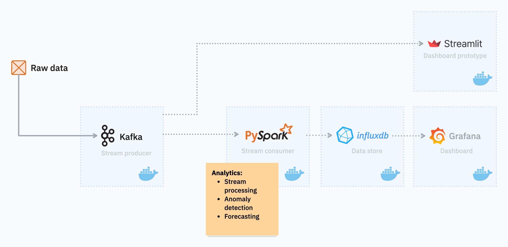

# Assignment 1

System architecture diagram and team member responsibilites of **Team T5_AirQual_Mate**.

## I. Architecture diagram

### Raw data

Static file containing sensor measurements related to air quality.

### Kafka producer

Reads the raw data file and streamlines the records into Kafka topics in their datetime order.

### PySpark consumer

Listens to the streamlined data and creates mini batches to call analytical functions—such as Anomaly Detection and Forecasting—on this windowed data.

### Influxdb

Data is then persisted in the database including the online predictions and the original incoming data.

### Grafana

Dashboard visualization component that periodically fetches the database for new data to show the latest insights in real-time.

## II. Team member responsibilities

| Team member        | Main responsibilities                               |
| ------------------ | --------------------------------------------------- |
| Albazzal, Houmam   | Containerization, Data Streamlining                 |
| Balogh, Máté       | Anomaly Detection, Pipeline Integration             |
| Földvári, Ádám     | ML modeling, Forecasting                            |
| Lahmar, Abderraouf | Calculation and Combination of Statistics, Database |
| Nagy, Zsuzsanna    | Dashboarding                                        |

### Containerization

Creating standalone self-contained Docker containers for the elements depicted in the architecture diagram.

### Data streamlining

Turning raw data into an ordered data flow, organized into Kafka topics.

### Anomaly detection

Detecting sudden changes in sensor readings.

### Pipeline integration

Overseeing and ensuring all the standalone components are compatible with each other.

### ML modeling, forecasting

Preparing the incoming data, selecting applicable ML algorithms and making forecasts on future sensor readings, along with classification of air quality.

### Statistics

Ensuring statistical functions are available at the online analytics phase, along with maintaining global estimations if necessary.

### Database

Creating database schema, along with setting up connections to persist and to read data.

### Dashboarding

Creating visualizations for forecasted sensor measurements and air quality classification, along with anomalies and the actual sensor readings.
