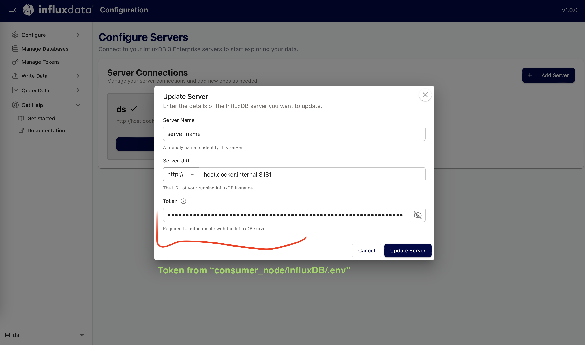
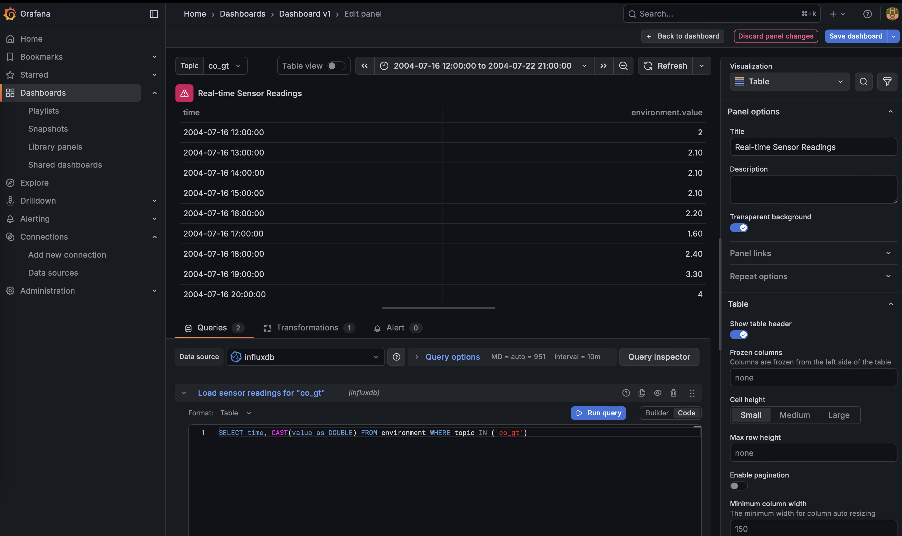

## Docker compose

```bash
# first start
./start-streaming.sh

# delete the compose stack to reset and start again
docker compose down
./start-streaming.sh
```


## Kafka

1. Verify messages are getting produced at [localhost:8080/ui/clusters/local/all-topics/co_gt/messages](http://localhost:8080/ui/clusters/local/all-topics/co_gt/messages)


## Influxdb

1. Visit influxdb ui at [http://localhost:8888/configure/servers](http://localhost:8888/configure/servers)
2. Configure a server
3. Check records at [http://localhost:8888/querytool/builder](http://localhost:8888/querytool/builder)




## Grafana

1. Add influxdb data source
2. Add query to dashboard panel


