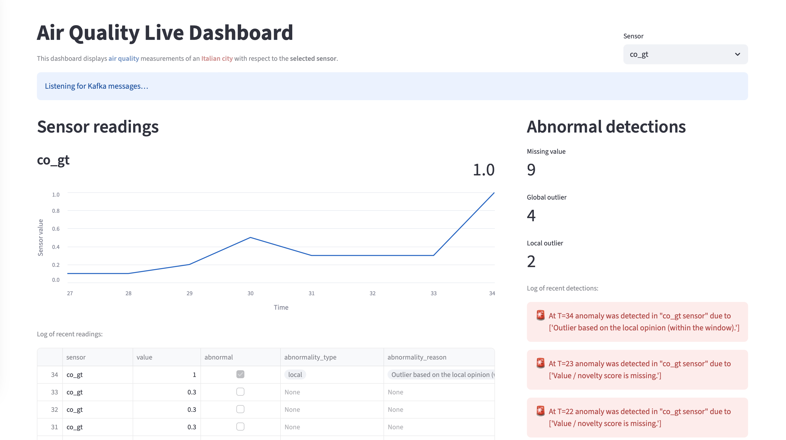

# Dashboard prototype

This dashboard prototype is created with *Streamlit* and reads directly from the *Kafka producer* while skipping the consumer and database components for quickly testing elements such as anomaly detector and visualizations.

## Instructions to run

1. Install requirements with `pip install -r dashboard/requirements.txt`
2. Start the streaming broker (see docker details in `streamer` folder). It shall run on `localhost:9092`
3. Run application with `streamlit run dashboard_prototype.py`
